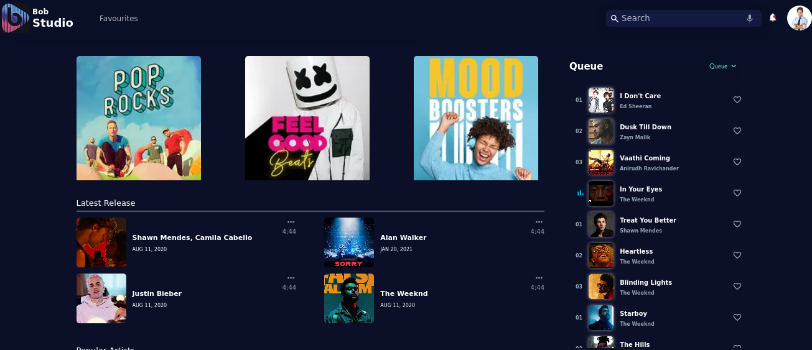
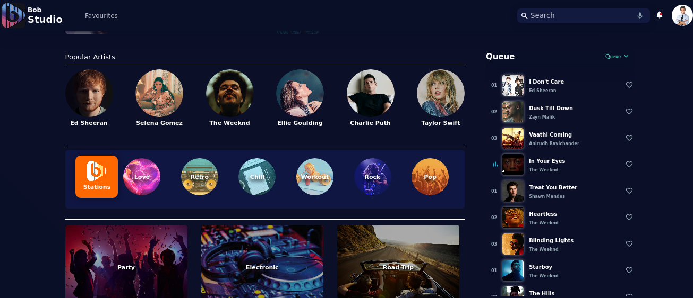
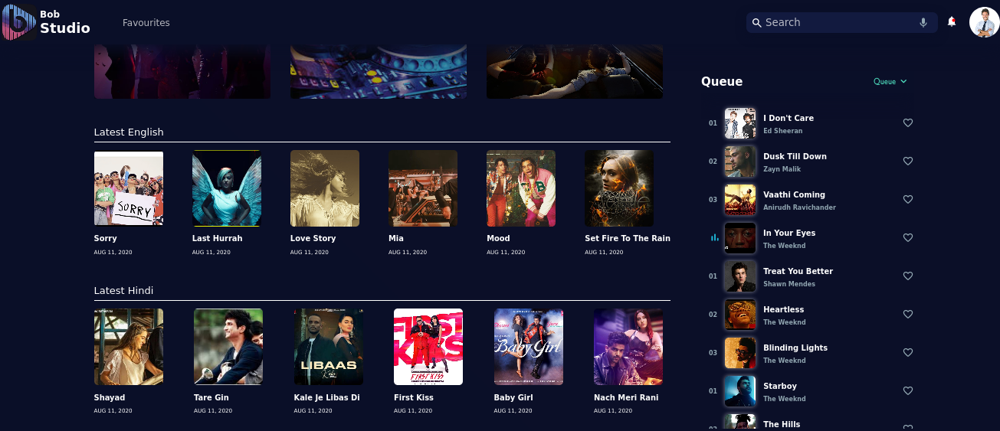
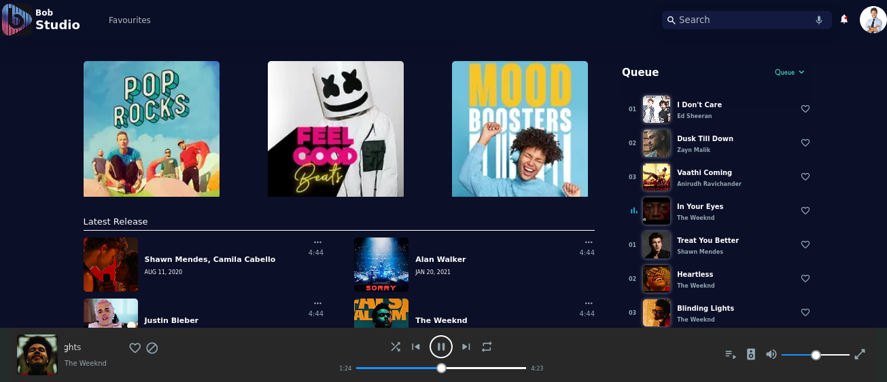
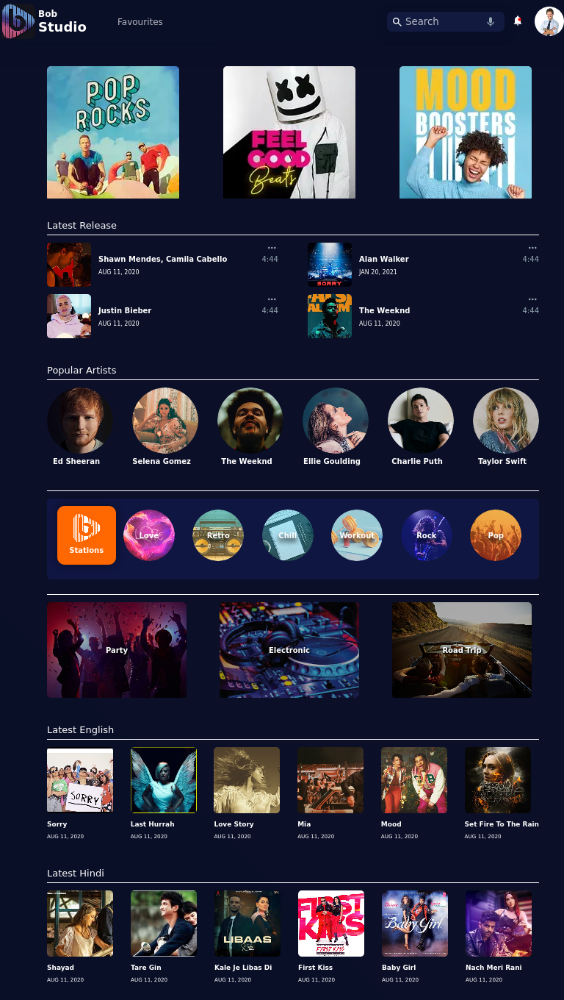
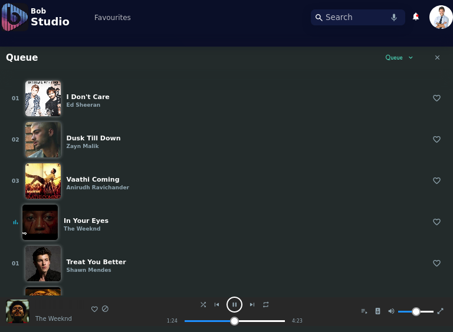
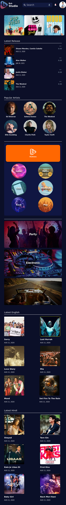
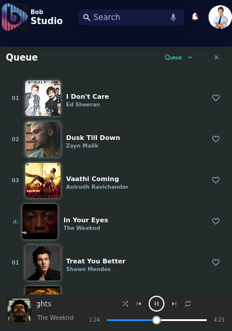
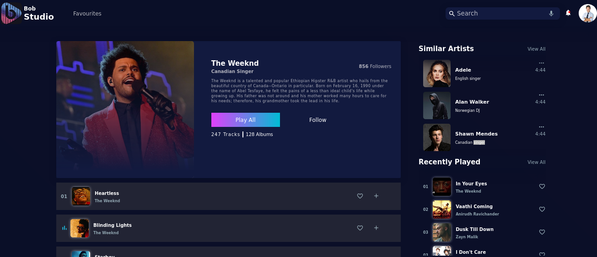
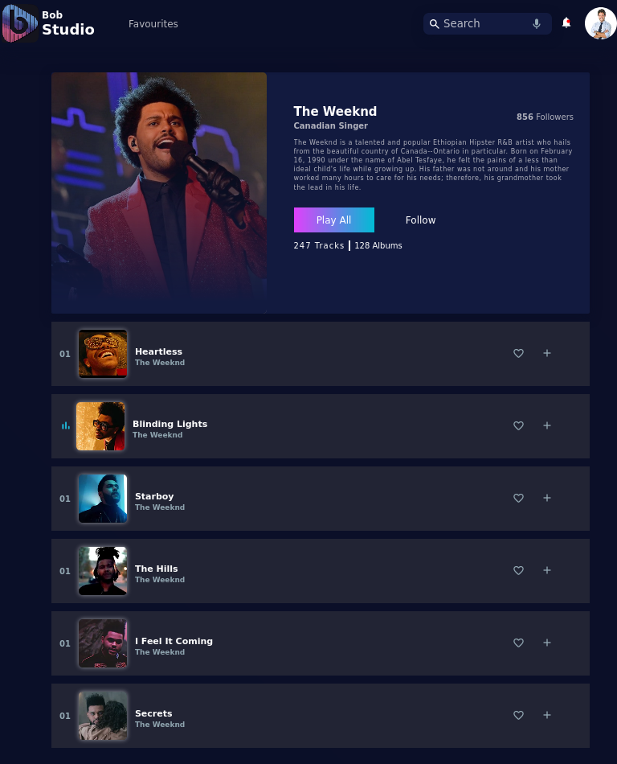

# music-player
## (https://amangupta262.github.io/music-player/)

- A music player user interface created using **HTML and CSS only**.

#### Home Page

- **Screen size > 992px**

- **Screen size > 768px**

- **Screen size > 576px**

#### Single Playlist

- **Screen size > 992px**

- **Screen size > 576px**

